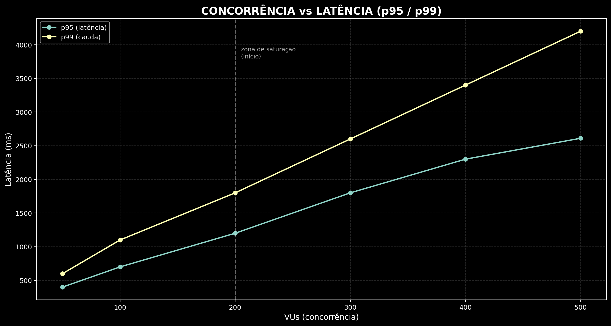

# Virtual Threads vs Platform Threads - Benchmark de Concorrência em Java

> Demonstração reproduzível e mensurável do impacto de **Virtual Threads (Project Loom)** vs **Platform Threads** sob carga concorrente com I/O bloqueante (PostgreSQL + HikariCP).

O que iremos observar? Comportamentos reais sob pressão:

- Throughput sob contenção
- Latência (p50, p95, p99)
- Comportamento de cauda (tail latency)
- Impacto de pools limitados (DB)

---

## Sumário

- [Arquitetura](#arquitetura)
- [Stack](#stack)
- [Como rodar](#como-rodar)
- [Configuração do teste](#configuração-do-teste)
- [Cenário testado](#cenário-testado)
- [Resultados](#resultados)
- [Análise](#análise)
- [Conclusões](#conclusões)
- [Limitações](#limitações)
- [Próximos experimentos](#próximos-experimentos)
- [Observabilidade](#observabilidade)
- [Contribuição](#contribuição)

---

## Arquitetura

```
Client (k6)
    ↓
HTTP Server (JDK HttpServer)
    ↓
Executor:
    ├── Virtual Threads (Loom)
    └── Platform Threads (Fixed Pool)
    ↓
Database (PostgreSQL)
    ↓
HikariCP (pool limitado)
```

---

## Stack

| Componente | Tecnologia                     |
|---|--------------------------------|
| Linguagem | Java 25                        |
| HTTP Server | JDK HttpServer                 |
| Concorrência | Virtual Threads (Project Loom) |
| Connection Pool | HikariCP                       |
| Banco de dados | PostgreSQL                     |
| Load test | k6                             |
| Métricas | Micrometer                     |
| Profiling | JFR                            |

---

## Como rodar

### 1. Subir o PostgreSQL

```bash
docker-compose up -d
```

### 2. Build

```bash
mvn clean package
```

### 3. Rodar o servidor

**Virtual Threads**

```bash
java -Dvirtual=true -Dlock=false -jar target/*.jar
```

**Platform Threads**

```bash
java -Dvirtual=false -Dlock=false -jar target/*.jar
```

### 4. Rodar o load test

```bash
k6 run k6/load.js
```

---

## Configuração do teste

VUs (Virtual Users) são os usuários simultâneos simulados pela ferramenta de load test, neste projeto o k6.

```js
export const options = {
  vus: 500,
  duration: '30s',
};
```

**Endpoint testado:**

```
GET /caramelo
```

---

## Cenário testado

| Parâmetro | Valor |
|---|---|
| Pool HikariCP | 50 conexões |
| Query | `SELECT pg_sleep(0.2)` |
| Concorrência | até 500 VUs |
| Duração | 30s |

---

## Resultados

### 🔴 Platform Threads

| Métrica | Valor |
|---|---|
| Throughput | 215 req/s |
| p50 | 1.41s |
| p95 | 5.09s |
| max | 10s |
| Erros | ~1.5% |

### 🟢 Virtual Threads

| Métrica | Valor |
|---|---|
| Throughput | 210 req/s |
| p50 | 2.03s |
| p95 | 3.93s |
| max | 6.22s |
| Erros | ~1.2% |



---

## Análise

### Throughput

Aproximadamente igual nos dois cenários, limitado pelo pool de conexões (DB), não pelo modelo de threads.

### Latência

| | Platform Threads | Virtual Threads |
|---|---|---|
| p50 | ✅ Melhor | Levemente maior |
| p95 / p99 | ❌ Pior | ✅ Significativamente menor |
| Cauda | Longa (até 10s) | Previsível (até 6.22s) |

### Insight principal

```
Virtual Threads NÃO aumentam throughput sob gargalo externo,
mas REDUZEM drasticamente tail latency (p95/p99).
```

### Por que isso acontece?

**Platform Threads**
- Threads bloqueadas ocupam recursos do SO
- Fila no executor cresce sob carga
- Starvation sob alta concorrência

**Virtual Threads**
- Bloqueio não consome thread do SO
- Scheduler mais justo (Loom)
- Melhor distribuição de execução

---

## Conclusões

- Throughput é dominado por recursos externos (DB), não pelo modelo de threads
- Virtual Threads melhoram previsibilidade de latência
- Platform Threads favorecem "requisições sortudas" (melhor p50)
- Virtual Threads reduzem latência de cauda (melhor p95/p99)

> **Produção se preocupa com p95, não com p50.**

---

## Limitações

- Query depende de cache do PostgreSQL
- Sem isolamento de CPU
- Sem controle de GC
- Ambiente local (não distribuído)

---

## Próximos experimentos

- [ ] Variar pool do HikariCP (10, 20, 100 conexões)
- [ ] Teste sem DB (CPU-bound vs IO-bound)
- [ ] Latência artificial com `pg_sleep`
- [ ] Métricas via Prometheus + Grafana
- [ ] Comparar com WebFlux / reactive stack
- [ ] Testar 1000+ VUs

---

## Observabilidade

### JFR (Java Flight Recorder)

```bash
-XX:StartFlightRecording=filename=recording.jfr
```

Eventos de interesse:

- `Thread Park`
- `Contention`
- `Socket Read`

### Métricas (Micrometer)

```
GET /metrics
```

---

## Contribuição

Pull requests são bem-vindos! Áreas de interesse:

- Novos cenários de benchmark
- Melhorias na metodologia de teste
- Integração com ferramentas de observabilidade

---